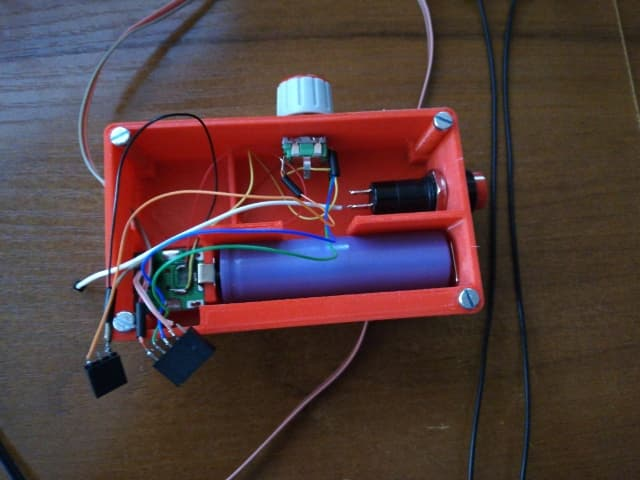

# Led Ring v2
This project is about led ring inspired by [this tutorial](https://learn.adafruit.com/3d-printed-camera-led-ring/overview) with some improvements.

Instead of trinket 5V - Arduino mini was used.
Instead of small battery - Powerbank was used.
Rotary encoder with button was used to change color and it's intensity.

Configuration is in header of source file:
```cpp
#define N_PIXELS 24 	//Number of Leds
#define LED_PIN 6		//Pin of led ring

#define PIN_ENCODER_A 2	//Pin A of rotary encoder
#define PIN_ENCODER_B 3	//Pin B of rotary encoder
#define PIN_ENCODER_SWITCH 4 //Pin of button in rotary encoder
```
All switches are connected to GND


